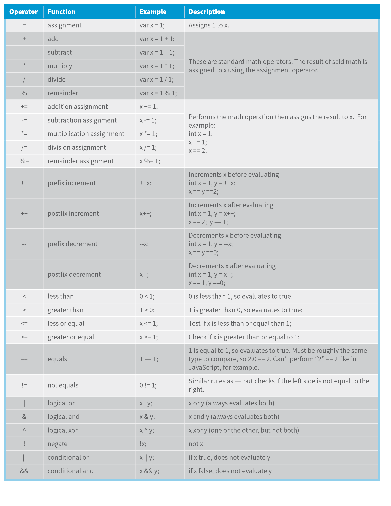

# C# Basics

### Naming Conventions
- Camel Case: **f**irst**N**ame
- Pascal Case: **F**irst**N**ame
- Hungarian Notation: str**F**irst**N**ame (datatype + name, not common in C#, but in C/C++)

### For local variables: Camel Case 
```csharp
int number: 1;
``` 
### For constants: Pascal Case 
```csharp
const int MaxZoom = 5;
```

### Primitive Types


### Real Numbers
double is the default datatype used by the compiler.

```csharp
float number = 1.2f;` For floats, add a suffix of f.
```

```csharp
decimal number = 1.2m;` For decimal, add a suffix of m.
```

### Non-Primitive Types
- String
- Array
- Enum
- Class

### Overflowing
```csharp
byte number = 255;
```

```csharp
number = number + 1; // -> 0
```

To fix this we can do:

```csharp
checked {
    byte number = 255;
    number = number + 1;
}
```

### Explicit Type Conversion

```csharp
// Int to Byte
int i = 1;
byte b = (byte)i;

// Float to Int
float f = 1.0f;
int i = (int)f;
```

### Non-compatible Types

```csharp
string s = "1";
int i = (int)s; // won't compile

string s = "1";
int i = Convert.ToInt32(s);
int j = int.Parse(s);
```

### Methods in the Convert Class
- ToByte()
- ToInt16()
- ToInt32()
- ToInt64()

## C# Operators
